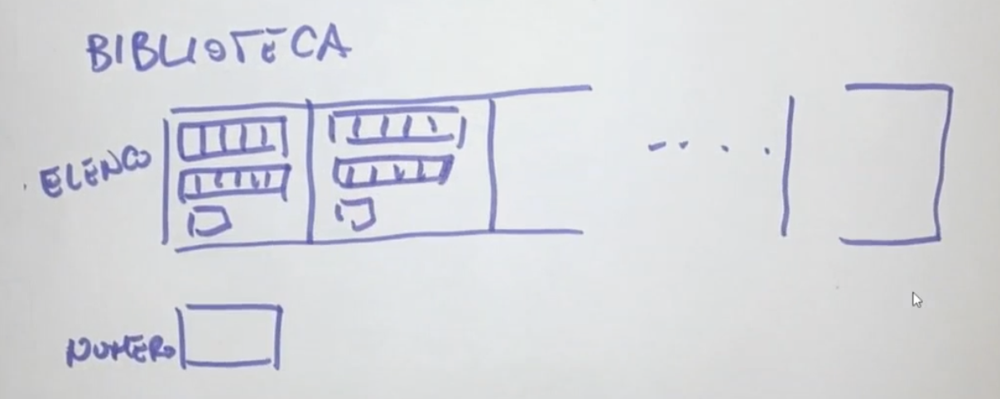
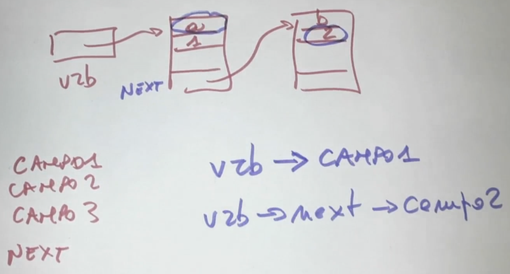

---
~
---
# Lezione 1
## File Header
```c
#include <stdio.h>
#include "PATH/nomefile.h"
```
Se modifico il codice di una funzione, ma non il suo prototipo, non dovrò modificare i file che la utilizzano, ma solo ricompilarli.
## Compilazione
- **pre-processing**: riceve in input un programma C, restituisce un programma C le cui direttive `#` sono state sostituite da altro testo.
- **compilatione**: traduce il file processato in linguaggio *assembly*.
```bash
gcc -S main.c
```
- **Assembling**: traduzione codice assembly a file oggetto (codice macchina).
```bash
gcc -c main.c -o main.o
```
- **Linking**: compone le diverse parti di codice in un'unico programma che può essere ccaricato in RAM per l'esecuzione. Otteniamo `main.out`
## Struttura file
```bash
.
├── README.md
├── bin
│   └── output.out
├── include
│   └── lib1.h
└── src
    └── source_code.c
    └── main.c
```

```bash
gcc src/source_code.c src/main.c -o bin/output.out
```
# Lezione 2
## Correttezza
Dato un array di interi, la funzione STAMPA visualizza tutti gli elementi dell'array.
```c
void stampa(int *arr) {
    ...
}
```
La funzioine deve trattare tutti i casi possibili, es: [1, 2, 3], [8, 5, 1], [2, , ], `NULL`.
## Progettazione delle funzioni: passi base
- Scrivere eventuali assunzioni sui dati ricevuti dalla funzione.
- Identificare i possibili casi da trattare e scrivere un esempio per ciascuno.
- Se la funzione contiene cicli: scrivere quale condizione è vera ad ogni iterazione.
- Scrivere la condizione che sarà vera (sui dati e sull'eventuale output prodotto) al termine dell'esecuzione.
### Esempio: funzione che effettua una divisione
- **Assunzioni inizali**: assumo che la funzione riceva due valori, dividendo e divisore, e che il divisore sia diverso da zero.
- **Descrizione del codice che esplica la funzione**: effettua il calcolo.
- **Condizione sul risultato**: quando il divisore è diverso da ' il risultato sarà il valore prodotto dal primo parametro fratto il secondo parametro, altrimenti restituisco il dividendo e un messaggio di errore.
### Scrittura per raffinamenti successivi
- Assunzioni sotto forma di commenti.
- Si trasformano via via i commenti in codice.
- Alla fine si prova il codice sull'insieme di casi precedentemente identificati.
### Si può guidare la scrittura corretta?
Quando il codice è lineare gli unici errori sono di tipo **sintattico** (compilatore) e di tipo **logico** (Test Suite).
Quando il codice è strutturato o fa dei richiami ricorsivi:
- bisogna garantire la **terminazione** della funzione (niente loop infiniti).
- Bisogna garantire che **ogni passo** (iterazione) dell'esecuzione rispetti una **proprietà di correttezza**.
Terminazione + correttezza parziale = correttezza
## Correttezza parziale
$fz(t_1 \ p_1, ..., t_n \ p_n)$ è **parzialmente corretta** quando: $\forall <x_1, ..., x_n>$ ennupla di valori rispettivamente di tipo $t_1, ..., t_n$ se vale che:
1. **P-IN$(x_1, ..., x_n)$** è vera;
2. l'esecuzione di $fz(x_1, ..., x_n)$ **termina restituendo y**, allora **P-OUT**$(x_1, ..., x_n, y)$ è vera.

1. **P-IN$(x_1, ..., x_n)$**: è una proprietà dell'input.
2. **P-OUT$(x_1, ..., x_n, y)$**: è una proprietà lega l'output all'input.
### Esempio: per `quadrato(int x)`:
`P_IN(x)`: x è un numero intero,
`P_OUT(x, y)`: è y == x * x.
Una funzione è **terminante** se $\forall <x_1, ..., x_n>$ tali per cui **P-IN$(x_1, ..., x_n)$** è vera, l'esecuzione di $fz(x_1, ..., x_n)$ termina.
Una funzione $fz(x_1, ..., x_n)$ è **corretta** se valgono due condizioni:
1. È parzialmente corretta.
2. È terminante.
```c
/*
    P_IN: Assumo di ricevere un array di dimensione N (N > 0).
    P_OUT: Il valore restituito satà uno dei valori contenuti nell'array, il più piccolo.
*/

int MINIMO(int a[], int N){
	int temp = a[0]; // definisco una variabile di comodo, temporanea e la inizializzo.
	int i; // inizializzo un indice.

    for(i=1, i<N, i++){ // ciclo per scorrere l'array
		if(a[i] < temp) // per decidere se aggiornarla la confronto con l'elemento corrente
			temp = a[i];
    }

	return temp; // alla fine restituisco il valore contenuto nella variabile temporanea.
}
```
La terminazione va dimostrata:
- Una sequenza termina sempre, se i suoi passi terminano.
- Un ciclo termina se interazione dopo iterazione ci si avvicina alla condizione di uscita.
- Qualcosa di simile vale per le funzioni ricorsive.

Ovvero:
- `MINIMO`contiene un **ciclo for**
- La condizione di uscita è che l'indice *1* (inizializzato a 0) **diventi uguale a N**.
- Ad ogni iterazione l'indice *i* aumenta di 1.
- Quindi, prima o poi, renderà vera la condizione di uscita, portando `MINIMO`a **terminazione**.
# Lezione 3
## Allocazione dinamica
`TIPO NOME;` dichiarazione.
`NOME = ESPRESSIONE;` assegnazione.
```c
int x;

x = 0;

x = x+1;
```
### Variabile
**TIPO**: Quanti byte occupa, come sono organizzati.
**NOME**: Identifica la variabile per il programmatore.
**INDIRIZZO**: Identifica l'area di memoria occupata dalla variabile per l'esecuzione.
**VALORE**: Dato contenuto nell'area di memoria di una variabile.

|          |          |
| ----------- | ----------- |
| **&vrb**   | Indica l'indirizzo della variabile `vrb` |
| ***indexp**   | L'operatore `*` dereferenzia un'espressione, cioè permette di accedere al contenuto della cella che ha l'indirizzo calcolato dall'espressione `indexp`        |
| ***(&vrb)**   | Caso particolare, indica il contenuto della variabile che ha per indirizzo `&vrb`        |

## Allocazione e deallocazione dinamica
Effettuate durante l'esecuzione del programma, occorre utilizzare delle funzioni predefinite:
```c
#include <stdlib.h>

void *malloc(size_t size);	// memory allocation

void free(void *ptr);
```
## `malloc`
`malloc`: allocazione dinamica (durante l'esecuzione del programma) della memoria. `malloc(8)` cerca nella RAM una porzione di memoria di almeno **8 byte** e la riserva per il programma che ne ha fatto richiesta.
`prt = (int *)malloc(sizeof(int));` assegna l'indirizzo della porzione di memoria riservata a `prt`. `(int *)`: casta il puntatore generico a un puntatore di tipo `int`, `sizeof(int)` restituisce il numero di byte occupati da un intero (8).
`void *malloc(8)`: `void *` indica un puntatore generico.
## `free`
`free(ptr)`: deallocazione della memoria precedentemente allocata.
## Allocazione statica vs dinamica
**Allocazione statica**:
```c
int x;
x = 0;
```
`0x7fff09a50eec`= 0
**Allocazione dinamica**:
```c
int *x;
x=(int *)malloc(sizeof(int));
*x = 0;
```
`0x7fff09a50eec`= `0x7fff09a50ef0`
`0x7fff09a50ef0` = 0
```c
free(x);
```
`0x7fff09a50eec`= `0x7fff09a50ef0`
`0x7fff09a50ef0` = errore

Programma in esecuzione -> processo -> ha allocata una porzione di RAM:

- Heap: memoria allocata dinamicamente. `malloc`, `free`.
- Stack: esecuzione, record di esecuzione, variabili allocate staticamente.
**Array**:
```c
int v[10];
```
Quanto spazio occupa? `10*sizeof(int)`.
Posso usare `v+1`? Sì, `v+1` è l'indirizzo del secondo elemento.
Posso fare `v++`? No, `v` è un puntatore costante.
**Allocazione dinamica di un array**:
```c
int *d;
...
d = (int *)malloc(10*sizeof(int));
```
`d` = `0xabdf08134ba0` ovvero `0xabcf08134ba0`"[0]", il primo elemento dell'array.
Quanto spazio occupa? Spazio array + `sizeof(int *)`, cioè 8 byte.
Posso usare `d+1`? Sì, `d+1` è l'indirizzo del secondo elemento.
Posso fare `d++`? Sì, `d` è un puntatore.
```c
free(d);

d = NULL;
```
Libero la RAM, assegno `NULL` al puntatore manualmente.
# `struct`
Collezione di dati correlati che posso essere disomogenei.
**Libro**:
- **Titolo**: stringa
- **Numero pagine**: intero
- **Autore**: stringa
- **Prezzo**: float
```c
struct libro {
	char titolo[MAXT];
	int pagine;
	char autore[MAXN];
	float prezzo;
};
```
Non ha allocata memoria, è solo una descrizione.
```c
struct libro L1;
```
`L1` è una variabile di tipo `struct libro`.
### Esempio
```c
struct cibo {
	char nome[MAX];
	struct dich_nutriz tabella;
} dispensa[MAXD];
```
In dispensa ci sono tanti cibi, ognuno con un nome e una tabella nutrizionale. Array di struct, ognuna comprende un'etichetta e una dichiarazione nutrizionale.

`DIESPENSA` contiene elementi omogenei ma di tipo articolato in campi strutturalmente complessi.
```c
dispensa[0].tabella.energia

dispensa[2].tabella.proteine
```

I campi hanno dimensione diversa. Sono allocati in ordine di specifica. I sistemi operativi non allocano la memoria a byte, ma a gruppi di 4, 8, 16, ... byte.
Una `struct` può avere allocata un po' più memoria dello stretto necessario(**padding**).
### Esempio di padding:
```c
struct prova {
	char x;
	char y;
	int z;
};
```

```c
sizeof(struct prova) = 8;

sizeof(char)*2 + sizeof(int) = 6;
```
# Lezione 4
## Tipi di dati composti
- **Array**: sequenza di elementi dello stesso tipo.
- **Struct**: insieme di elementi di tipo diverso.
```c
struct {
	char titolo[MAXT];
	char autore[MAXA];
	int pagine;
} L1, L2; // variabili con questa tipo di struct

struct libro { // dichiarato un nome della struct
	char titolo[MAXT];
	char autore[MAXA];
	int pagine;
};
```

```c
struct libro L1; // struct libro è un nome associato ad una descrizione di certi dati in memoria
```
## `typedef`
Viene utilizzata per dichiarare dei *tipi*.
```c
typedef int NUM_P; // nome di un nuovo tipo per numeri di pagine
NUM_P x;
```
Possiamo associare a una struttura un nuovo nome di tipo.
```c
typedef struct {
	char titolo[MAXT];
	char autore[MAXA];
	int pagine;
} LIBRO;

LIBRO L; // dichiaro una variabile L di tipo LIBRO
```
Come negli array posso accedere alle varie informazioni che `LIBRO` contiene. Nelle strutture non si accede per posizione, ma per **nome**.
```c
L.titolo = "Ciao";
L.autore
L.pagine = 100;

strcpy(x, L.titolo); // copia il contenuto di L.titolo in x
```
### Padding
```c
sizeof(LIBRO) = k;
sizeof(char) + N + sizeof(char) * M + sizeof(int) + sizeof(int) = q;
```

Ci sono casi in cui `k > q`. Perché l'OS assegna alla memoria un processo per multipli di una certa quantità di byte.
Posso costruire la struttura anche in modo dinamico, tramite `malloc`.
```c
LIBRO *PL;
PL =  (LIBRO *)malloc(sizeof(LIBRO)); // cast a tipo LIBRO, PL è un indirizzo
```

```c
PL -> titolo; // indica che PL è un puntatore a una struttura, accede al campo titolo
```
## Esercizio
```c
#include <stdio.h>
#include <stdlib.h>
#include <string.h>

#define MAXT 10
#define MAXA 200
#define MAXL 20

//
// Definizione del tipo LIBRO
//
typedef struct {
	char titolo[MAXT];
	char autori[MAXA];
	int pagine;
} libro;

// Definizione del tipo bib (biblioteca)
typedef struct {
	libro elenco[MAXL]; // elenco dei libri
	int numero;         // num. libri al momento
} bib;

// controlla se la biblioteca è piena
int piena(bib B) {
    return (B.numero == MAXL);
}

// visalizzazione dei contenuti di una variabile di tipo bib
void stampa_bib(bib B) {
	int i, top = B.numero;
	for(i=0; i<top; i++) printf("\n[%d] %s %s %d", i, B.elenco[i].titolo, B.elenco[i].autori, B.elenco[i].pagine);
	printf("\n");
}

// se B non è piena aggiunge i dati relativi a un nuovo libro senza cancellare dati precedenti e in maniera consecutiva ai dati relativi a libri inseriti fino a quel momento
void inserisci(bib *B, char *t, char *a, int p) {
	if (!piena(*B)) {
		B->elenco[B->numero].pagine = p;
		strcpy(B->elenco[B->numero].titolo, t);
		strcpy(B->elenco[B->numero].autori, a);
		B->numero++;
	}
	else printf("\nATTENZIONE: biblioteca piena\n");
}

// vista a lezione: inizializza una variabile di tipo bibi riferita da B (biblioteca vuota)
void init(bib *B) {
	B->numero=0;
}

int main() {
    bib biblioteca; // dichiaro una variabile di tipo biblioteca
    
    init(&biblioteca); // la inizializzo
    
    inserisci(&biblioteca,"1984","Orwell",250); // inserisco un libro
    inserisci(&biblioteca,"Odissea","Omero",200); // inserisco un altro libro
    
    stampa_bib(biblioteca); // vedo cosa contiene
}
```

## `init` statico e dinamico
```c
init(&statica);

init(&dinamica);
```
# Lezione 5
## Puntatori come cursori di array
Il nome di un array è di per sè un puntatore.
```c
main(){
	int prova[N];
	init(prova);
	...
}
```
Stack di esecuzione:
init a[indirizzo]
prova[indirizzo della prima cella dell'array] -> [][][]...[]
```c
void init(int *a) {
	for(int i=0; i<N, i++, a++){
		*a = 100+i;
	}
}
```

```c
int main(){
	int prova[N];
	int *cursore;
	int valore;

	init(prova);

	for(cursore = prova + 9, valore = 1; cursore != prova; cursore--, valore++){
		// cursore punta all'ultima cella dell'array prova
		// cursore viene decrementato, punta alla cella precedente
		*cursore = valore;
	}
}
```
[10][9][8][7][6][5][4][3][2][1] (prova[10])
## Strutture dati ricorsive
Gli elementi di una struttura dati ricorsiva si dicono **nodi**.
**Linked List**:
Struttura dati lineare, una sequenza.
*Definizione ricorsiva*:
- È **vuota** (-*)
- È **costituita da un elemento seguito da una linked list** ([n])
[a]->[b]->[c]-*
Ruoli:
- [a]: primo elemento, predecessore di [b]
- [b]: predecessore di [c], successore di [a]
- [c]: ultimo elemento, successore di [b]
Quando rimuovo un nodo da una lista, la lista deve essere ancora consistente.
Errore:
[a]->[x]-*
Giusto:
[a]-*
Togliere il primo nodo significa spostare il cursore al secondo nodo.
**Lista vuota** = `NULL`
La variabile deve essere un puntatore ad un nodo.
`tipo-nodo *spesa;`
Per aggiungere un elemento devo:
- Creare un nodo (uova)
- Aggiungi nodo a spesa:
  - successore di nodo = spesa
  - spesa = indirizzo di nodo
```c
spesa = NULL; // [uova]-*

// spesa[* [uova]-*]
```
Creare nodo invoca una `malloc`, quindi la memoria è allocata dinamicamente.
I nodi allocati si trovano nell'**heap**.
Ogni nodo è una struttura dati composta da almeno 2 parti:
- **Dati**
- **Link al successore** (`NULL` in assenza su di successori)
```c
struct nodo {
	int num;// campi dati

	struct nodo *next; // link al successore
};

struct nodo spesa;
```
Dobbiamo trovare una convenzione per sapere che la lista è vuota. Sprecando spazio nella memoria per dire ciò. Basterebbe un puntatore a `NULL`.
```c
struct nodo {
	int num;// campi dati

	struct nodo *next; // link al successore
};

struct nodo *spesa;
```
La variabile che permette l'accesso alla lista deve essere un **puntatore** (`*spesa`). Cos' facendo `spesa` non ha lo spazio per contenere un nodo, ma solo quello per contenere un indirizzo.
Il primo nodo è creato con la `malloc` solo quando serve.
```c
x = (struct nodo *)malloc(sizeof(struct nodo));
```
In modo più fine usiamo il `typedef`.
```c
typedef struct nodo *lista;

struct nodo {
	// campi dati

	lista next; // successore
};

lista spesa = NULL;

x = (lista)malloc(sizeof(struct nodo));
```
In memoria bbiamo sempre `spesa` (in stack) che punta al primo nodo (in heap).
### Accedere ai vari elementi della lista

# Lezione 6
Modificare *la testa* di una lista:
```c
lista L;
```
Come cancelliamo il primo elemento senza perdere tutta la lista? Ricordiamo che gli elemento successivo al primo si accedono con una catena di puntatori.
Il campo *NEXT* contiene il riferimento al nodo successivo.
![[Pasted image 20240418160032.png]]
Due casi particolari sono:
1. Il primo è anche l'ultimo nodo.
2. La lista è vuota (`NULL`).
![[Pasted image 20240418160308.png]]
```c
if(vrb != NULL){
	vrb = vrb->next;
}
// else lista vuota
```
Il nodo però continua ad occupare la memoria, C non ha un sistema di Garbage Collection. Dobbiamo liberare la memoria manualmente:
```c
if(vrb != NULL){
	Lista tmp = vrb; // diventa un nuovo punto di accesso ad a
	vrb = vrb->next;
	free(tpm); // disalloca la memoria
}
```
## Funzione per cancellare il primo elemento di una lista
### Versione 1
```c
ML = cancella_testa(ML);

Lista cancella_testa(Lista L){
	Lista tmp = L->next;
	free(L);

	return(tmp);
}
```
![[Pasted image 20240418162314.png]]
### Versione 2
```c
cancella_lista(&ML);

void cancella_lista(Lista *L){
	Lista tmp = *L;
	*L = (*L)->next;
	free(tmp);
}
```
![[Pasted image 20240418163023.png]]
## Inserisci nodo in testa
### Versione 1
![[Pasted image 20240418163746.png]]
```c
Lista ML;
Lista nuovo = crea_nodo(...);
ML = aggiungi_testa(ML, nuovo);

Lista crea_nodo(...dati...){
	Lista nuovo_nodo = (Lista)(malloc(sizeof(struct nodo)));
	nuovo_nodo->dato1 = ...;
	nuovo_nodo->next = NULL;

	return nuovo_nodo;
}

Lista aggiungi_testa(Lista L, Lista nuovo_nodo){
	nuovo_nodo->next = L;
	return nuovo_nodo;
}
```
### Versione 2
```c
Lista ML, nuovo;
aggiungi_nodo(&ML, nuovo);

void aggiungi_nodo(Lista *L, Lista nuovo_nodo){
	nuovo_nodo->next = *L;
	*L = nuovo_nodo;
}
```
# Lezione 7
## Funzioni ricorsive
*Esempio del fattoriale*:
```c
int fattoriale(int n){
	if(n<0){
		fprinf(stderr, "errore");
	} else if(n<=1){
		return 1;
	} else {
		return n*fattoriale(n-1);
	}
}
```
### Ricorsione in testa
```c
int fattoriale(int n){
	int tmp;
	if(n<0){
		fprintf(stderr, "errore);
	} else if(n>1){
		tmp = fattoriale(n-1);
	} else {
		tmp = 1;
	}
	return n*tmp;
}
```
La ricorsione permette di scrivere codice compatto e facile da interpretare.
È detta *lineare* quando produce una singola sequenza di chiamate.
La *ricorsione lineare in coda* corrisponde a un ciclo.
La ricorsione comporta un *overhead* dovuto alla creazione/rimozione del relativo record di attivazione.
## Ricorsione e Linked List
Le liste linkate si prestano a essere manipolate tramite funzioni ricorsive per via della propria natura ricorsiva, una lista:
- È vuota
- Oppure è un elemento seguito da una lista
![[Pasted image 20240419153153.png]]
Vogliamo calcolare la somma dei valori contenuti nei nodi di una lista linkata:
- Procedimento:
	- percorri la lista accumulando i valori via via incontrati
- Caso base:
	- lista vuota, che valore produce?
- Calcolo:
	- somma: valore nodo corrente + somma lista che lo seguente
*Esempio*:
```c
int somma_nodi(lista L){
	if(L == NULL){
		return 0;
	} else {
		return(L->dato + somma_nodi(L->next));
	}
}
```
![[Pasted image 20240419153708.png]]
![[Pasted image 20240419153726.png||150]]
## Rimozione ricorsiva di una lista
Rimuovere una lista non significa solo togliere gli elementi da essa, ma anche liberare la memoria da lei occupata tramite `free`.
```c
#include<stdlib.h>
void *malloc(size_t size);
void free(void *ptr);
```
## Rimozione in coda con ricorsione in testa
### Lista passata per rifrimento
```c
void elimina_lista(lista *L){
	if(L){} // se il parametro è definito
	
	if(*L){  // se la lista non è vuota
		elimina_lista(&((*L)->next)); // mi sposto in avanti
		free(*L); // libero il noto (attualmente ultimo)
		*L=NULL; // segno che dopo non c'è più nulla
	}
}
```
Il primo `if` controlla se il parametro è significativo.
Il secondo `if` controlla se la lista è vuota.
### Lista passata per valore
```c
lista elimina_lista2(lista L){
	if(L){ // ricorsione in testa, mi sposto in fondo
		L->next = elimina_lista2(L->next);
		free(L); // dealloco i nodi a ritroso
		return NULL;
	} else {
		return null;
	}
}
```
# Lezione 8
## Stampa Lista Linkata
```c
void stampa(lista L){
	if(L != NULL){
		printf("%d", L->dato);
		stampa(L->next);
	} else {
		printf("\n");
	}
}
```
![[Pasted image 20240419162748.png]]
## Funzioni ricorsive su elemento generico
### Liste linkate ordinate
Il modo in cui i nodi sono posizionati rispetta una relazione di ordine.

*Stringhe* $\Rightarrow$ *Ordinamento lessicografico*
*Insieme* $\Rightarrow$ *Inclusione*
Ogni operazione che modifica la lista deve mantenerla ordinata.
*Es*:
Se vogliamo aggiungere un elemento dobbiamo iterare la lista alla ricerca della posizione corretta nel quale aggiungere il valore.
### Lista passata per valore
Assunzioni:
- `L` lista ordinata
- `nodo` nodo di una lista
	- struttura dati allocata nel chiamante
	- `next = NULL`
P-out:
- `L` ordinata che contiene tutti gli elementi precedenti nelle stesse relazioni e in più contiene `nodo`
```c
lista ML;
ML = ins_ordinata(ML, crea_nodo(8));

lista crea_nodo(int n){};

lista ins_ord(lista L, lista nodo){
	if(L){ // se non è vuota
		if(nodo->dato <= L->dato){
			nodo->next = L;
			return nodo;
		} else if(!(L->next)){
			L->next = nodo;
			nodo->next = NULL;
			return (L);
		} else if(nodo->dato < L->next->dato){
			nodo->next = L->next;
			L->next = nodo;
			return L;
		} else {
			L->next = ins_ord(L->next, nodo);
			return L;
		}
	} else {
		return nodo;
	}
}
```
### Lista passata per riferimento
```c
lista ML;
ins_ord(&L, crea_nodo(8));

lista crea_nodo(int n){};

void ins_ord2(lista *L, lista nodo){
	if(!L){
		printf("L inconsistente");
	} else if(*L){ // se non è vuota
		if(nodo->dato <= *L->dato){
			nodo->next = *L;
			*L = nodo;
		} else if(!(*L)->next){
			(*L)->next = nodo;
			nodo->next = NULL;
		} else if(nodo->dato < (*L)->next->dato){
			nodo->next = (*L)->next;
			(*L)->next = nodo;
		} else {
			ins_ord2(&((*L)->next)), nodo);
		}
	} else {
		*L = nodo;
	}
}
```
# Lezione 8
## Esercizi
### Raddoppia i nodi pari (crea nuovo nodo con il numero pari)
**Passato per valore**:
```c
lista raddoppia_pari(lista L){
	if(!L) return NULL; // se vuota ritorna NULL
	else if(!(L->dato % 2)){ // se il dato è pari
		lista doppione = crea_nodo(L->dato);
		doppione->next = L;
		L->next = raddoppia_pari(L->next);
		return doppione;
	} else { // nodi con dato dispari
		L->next = raddoppia_pari(L->next);
		return L;
	}
}
```
### Rimuovi nodi scelti con un valore scelto dall'utente
**Passato per referenza**:
```c
togli_titti(&ML, 3); // lista, valore da rimuovere

void togli_tutti(lista *L, int togli){
	if(L){
		if(*L){ // nodo da togliere
			if((*L)->dato == togli){
				lista tmp = *L;
				// rimozione nodo dalla lista e dalla memoria
				*L = (*L)->next;
				free(tmp);
				
				togli_tutti(L, togli)
			} else {
				togli_tutti(&((*L)->next), togli);
			}
		}
	} else {
		printf("Lista vuota);
	}
}
```
![[Pasted image 20240420144455.png]]
## Abstract data types (ADT)
**Esempio**: sistema della RADIO:
```c
#define ON 1
#define OFF 0

typedef struct{
	int accensione = OFF;
	int canase;
} radio;
```
**Operazioni**:
```c
void accendi(radio *r){
	r->accensione = ON;
}

void spegli(radio *r){
	r->accensione = OFF;
}

void sincronizza(radio *r, int c){
	r->canale = c;
}
```
# ADT
## Stack
**Pila** di elementi.
*Last in first out*. (LIFO)
![[Pasted image 20240420150301.png|250]]
### Funzioni su Stack
`push`per inserire l'elemento in "alto" alla fila.
```c
void push(tipo elem, stack *s);
```
`pop`per rimuovere l'elemento più in alto della fila.
```c
tipo pop(stack *s);
```
`empty`test per sapere se lo stack è vuoto.
```c
int empty(stack s);
```
`full` test per sapere se lo stack è pieno.
```c
int full(stack s);
```
`peek` "guarda" l'elemento in cima allo stack.
```c
tipo peek(stack s);
```
# Lezione 9
### Ripasso
```c
typedef struct lista{
	char* stringa;
	int num;
	struct lista *next;
} ls, *puntLis;

int main(){
	ls *list;
	puntLis lsp;

	list = (ls*)malloc(sizeof(ls));
	lsp = (puntLis)malloc(sizeof(struct lista));
}
```
## ADT
## Stack con array
```c
#define MAX 5

typedef struct {
	int dato[MAX];
} stack;

void init(stack *s){
	if(s){
		s->top = 0;
	} else {
		printf("Stack non esistente.");
	}
}

int empty(stack s){
	return(!s.top);
}

int full(stack s){
	return(s.top == MAX);
}

void push(int elem, stack *s){
	if(s){ // se esiste
		if(!full(*s)){ // se non è pieno
			s->dato[s->top] = elem;
			s->top = s->top+1;
		} else {
			printf("Stack pieno.");
		}
	} else {
		printf("Stack inesistente.");
	}
}

int pop(stack *s){
	int result = novalue;
	if(s){
		if(!empty(*s)){
			result = s->dato[s->top-1];
			s->top = s->top-1;
		} else {
			printf("Stack vuoto.");
		}
	} else {
		printf("Stack inesistente.");
	}
	return result;
}

int peek(stack s){
	int result = novalue;
	if(s){
		if(!empty(*s)){
			result = s.dato[s.top-1];
		} else {
			printf("Stack vuoto.");
		}
	} else {
		printf("Stack inesistente.");
	}
	return result;
}

stack ms; // stack del main
int r;

// ... inseriti dati in ms

r = pop(&ms); // r contiene un dato o novalue

if(r != novalue){
	// elabora r
} else {
	// gestisci la situazione anomala
}
```
![[Pasted image 20240421153509.png]]
**Principali usi dello Stack**:
- supportare esecuzione dei processi
- inversione di una stringa
- compilatori
- browser
- sistemi operativi
## Queue
*First in first out*. (FIFO)
![[Pasted image 20240421155703.png|550]]
**Coda** è l'estremo al quale vengono aggiunti gli elementi.
**Testa** è l'estremo al quale vengono rimossi gli elementi.

`enqueue`: aggiungere un elemento a una queue.
`dequeue`: togliere un elemento dalla queue.

**Prototipi di funzione**:
```c
void enqueue(int elem, gda *q);

tipo dequeue(gda *q);
```

```c
int full(coda q);

int empty(coda q);

tipo peek(coda q);

void init(coda *q);
```
**Implementazioni su array**
![[Pasted image 20240421161756.png|550]]
Quando un elemento viene aggiunto *T* si sposta verso destra, stessa cosa per *H* quando rimuovi un elemento. Quando "lo spazio è finito" e si esegue un altro `enqueue`, *T* torna al primo elemento, funziona in modo circolare. Prende il nome di array (o *debuffer*) circolare.
![[Pasted image 20240421162209.png||250]]
![[Pasted image 20240421162404.png|350]]
```c
int successore(i, N){
	return((i+1) % N);
}
```

```c
#define MAX 1000

typedef struct{
	int dato[MAX];
	int head; // dove si toglie
	int tail; // dove si aggiunge
	int num; // numero di elementi nella queue
} queue;
```

```c
int empty(queue q){
	return(!q.num);
}

int full(queue q){
	return(q.num == MAX);
}
```
**Aggiungere elemento**:
```c
void enqueue(queue *q, int elem){
	if(q){
		if(!full(*q)){
			q->tail = successore(q->tail, MAX);
			q->dato[q.tail] = elem;
			q->num++;
		} else{
			printf("Queue piena.");
		}
	} else {
		printf("La queue non esiste.");
	}
}
```
**Rimuovere elemento**:
```c
int dequeue(queue *q){
	int result = novalue;
	if(q){
		if(!empty(*q)){
			result = q->dato[q->head];
			q->head = successore(q->head, MAX);
			q->num--;
		} else {
			printf("Queue vuota.");
		}
	} else {
		printf("La queue non esiste.");
	}
	return result;
}
```
# Lezione 10
## Queue su Linked List
**lista.h**
```c
#ifndef LISTA_H
#define LISTA_H

// Define the struct nodo
struct nodo {
    int dato1;
    struct nodo *next;
};

// Define 'lista' type, a pointer to struct nodo
typedef struct nodo *lista;

// Create a new node
lista crea_nodo(int elem);

// Define the queue structure
typedef struct {
    lista head; // oldest elem
    lista tail; // newer elem
    int num;    // number of elements in the queue
} queue;

// Function to check if the queue is empty
int empty(queue q);

// Function to initialize the queue
void init(queue *q);

// Function to add an element to the queue
void enqueue(queue *q, int elem);

// Function to remove and return an element from the queue
int dequeue(queue *q);

// Function to peek an element from the queue
int peek(queue *q);

#endif /* LISTA_H */
```
**main.c**
```c
#include "lista.h"
#include <stdlib.h>
#include <stdio.h>

lista crea_nodo(int elem){
	lista nuovo_nodo = (lista)(malloc(sizeof(struct nodo)));
	nuovo_nodo->dato1 = elem;
	nuovo_nodo->next = NULL;

	return nuovo_nodo;
}

int empty(queue q){
	return(q.num == 0);
}

void init(queue *q){
	q->head = NULL;
	q->tail = NULL;
	q->num = 0;
}

void enqueue(queue *q, int elem){
	lista nuovo = crea_nodo(elem);

	if(q){
		if(empty(*q)){
			q->head = nuovo;
			q->tail = nuovo;
			q->num = 1;
		} else {
			q->tail->next = nuovo; // (1)
			q->tail = nuovo; // (2)
			q->num++;
		}
	}
}

int dequeue(queue *q){
	int result = -1;
	lista tmp;

	if(q){
		if(!empty(*q)){
			result = q->head->dato1;
			tmp = q->head;
			q->head = q->head->next;
			free(tmp);
			q->num--;
		}
	}

	return result;
}

int peek(queue *q){
	if(q && !empty(*q)){
		return q->head->dato;
	} else {
		return -1;
	}
}

int main(void){
	queue mq;
	// inizializza gli elementi della coda, rende la coda vuota 
	init(&mq);

	enqueue(&mq, 10);
	enqueue(&mq, 20);
	enqueue(&mq, 30);

	printf("Peeked the element: %d\n", peek(&mq));

	printf("Dequeued element: %d\n", dequeue(&mq));
	printf("Dequeued element: %d\n", dequeue(&mq));
	printf("Dequeued element: %d\n", dequeue(&mq));

	return 0;
}
```
![[Pasted image 20240427154431.png]]
## ADT set
```bash
Set: { 30 20 10 }
Cardinality: 3
Is 20 in the set? Yes
After removing 20: { 30 10 }
Cardinality: 2
```

```c
#include <stdio.h>
#include <stdlib.h>
#include <stdbool.h>

// Define the structure of a set node
typedef struct SetNode {
    int data;
    struct SetNode *next;
} SetNode;

// Define the structure of a set
typedef struct {
    SetNode *head;
} Set;

// Function to create a new set
Set* createSet() {
    Set *newSet = (Set*)malloc(sizeof(Set));
    if (newSet == NULL) {
        printf("Memory allocation failed\n");
        exit(EXIT_FAILURE);
    }
    newSet->head = NULL;
    return newSet;
}

// Function to check if a set is empty
bool isEmpty(Set *set) {
    return set->head == NULL;
}

// Function to check if an element is present in the set
bool contains(Set *set, int value) {
    SetNode *current = set->head;
    while (current != NULL) {
        if (current->data == value) {
            return true;
        }
        current = current->next;
    }
    return false;
}

// Function to add an element to the set
void add(Set *set, int value) {
    if (!contains(set, value)) {
        SetNode *newNode = (SetNode*)malloc(sizeof(SetNode));
        if (newNode == NULL) {
            printf("Memory allocation failed\n");
            exit(EXIT_FAILURE);
        }
        newNode->data = value;
        newNode->next = set->head;
        set->head = newNode;
    }
}

// Function to remove an element from the set
void removeElement(Set *set, int value) {
    SetNode *current = set->head;
    SetNode *prev = NULL;
    while (current != NULL) {
        if (current->data == value) {
            if (prev == NULL) {
                set->head = current->next;
            } else {
                prev->next = current->next;
            }
            free(current);
            return;
        }
        prev = current;
        current = current->next;
    }
}

// Function to calculate the cardinality of the set
int cardinality(Set *set) {
    int count = 0;
    SetNode *current = set->head;
    while (current != NULL) {
        count++;
        current = current->next;
    }
    return count;
}

// Function to print the elements of the set
void printSet(Set *set) {
    SetNode *current = set->head;
    printf("{ ");
    while (current != NULL) {
        printf("%d ", current->data);
        current = current->next;
    }
    printf("}\n");
}

// Test the set implementation
int main() {
    Set *mySet = createSet();

    add(mySet, 10);
    add(mySet, 20);
    add(mySet, 30);
    add(mySet, 20); // Adding duplicate element, should not be added

    printf("Set: ");
    printSet(mySet);

    printf("Cardinality: %d\n", cardinality(mySet));

    printf("Is 20 in the set? %s\n", contains(mySet, 20) ? "Yes" : "No");

    removeElement(mySet, 20);

    printf("After removing 20: ");
    printSet(mySet);

    printf("Cardinality: %d\n", cardinality(mySet));

    return 0;
}
```

## ADT multiset/bag
```bash
Multiset: { 20 30 20 20 10 }
After removing 20: { 30 20 20 10 }
```

```c
#include <stdio.h>
#include <stdlib.h>
#include <stdbool.h>

// Define the structure of a multiset node
typedef struct MultisetNode {
    int data;
    struct MultisetNode *next;
} MultisetNode;

// Define the structure of a multiset
typedef struct {
    MultisetNode *head;
} Multiset;

// Create a new multiset
Multiset* createMultiset() {
    Multiset *newMultiset = (Multiset*)malloc(sizeof(Multiset));
    if (newMultiset == NULL) {
        printf("Memory allocation failed\n");
        exit(EXIT_FAILURE);
    }
    newMultiset->head = NULL;
    return newMultiset;
}

// Check if a multiset is empty
bool isEmpty(Multiset *multiset) {
    return multiset->head == NULL;
}

// Add an element to the multiset
void add(Multiset *multiset, int value) {
    MultisetNode *newNode = (MultisetNode*)malloc(sizeof(MultisetNode));
    if (newNode == NULL) {
        printf("Memory allocation failed\n");
        exit(EXIT_FAILURE);
    }
    newNode->data = value;
    newNode->next = multiset->head;
    multiset->head = newNode;
}

// Remove an element from the multiset
void removeElement(Multiset *multiset, int value) {
    MultisetNode *current = multiset->head;
    MultisetNode *prev = NULL;
    while (current != NULL) {
        if (current->data == value) {
            if (prev == NULL) {
                multiset->head = current->next;
            } else {
                prev->next = current->next;
            }
            free(current);
            return;
        }
        prev = current;
        current = current->next;
    }
}

// Print the elements of the multiset
void printMultiset(Multiset *multiset) {
    MultisetNode *current = multiset->head;
    printf("{ ");
    while (current != NULL) {
        printf("%d ", current->data);
        current = current->next;
    }
    printf("}\n");
}

// Test the multiset implementation
int main() {
    Multiset *myMultiset = createMultiset();

    add(myMultiset, 10);
    add(myMultiset, 20);
    add(myMultiset, 20); // Adding duplicate elements
    add(myMultiset, 30);
    add(myMultiset, 20);
    
    printf("Multiset: ");
    printMultiset(myMultiset);

    removeElement(myMultiset, 20);

    printf("After removing 20: ");
    printMultiset(myMultiset);

    return 0;
}
```
# Lezione 11
**Esempio cani**
# Lezione 12
## Strutture dati ricorsive non lineari
Il *set* non è una struttura dati lineare. Ogni elemento non ha un predecessore e successore, dal punto di vista concettuale, non di Implementazione.
## Tree
Può essere:
- Vuoto.
- Nodo che ha per successori uno o più alberi.
Il primo nodo è detto *radice*.
I nodi senza successori sono detti *foglie*, l'insieme delle foglie costituisce la *frontiera* dell'albero. Gli altri sono detti *nodi interni*.
Ogni nodo diverso dalla radice ha un *nodo genitore (parent)*, il nodo di cui il nostro è successore.
Tutti i diretti successori di un nodo sono detti *figli (child)*.
I *discendenti* sono i nodi del sottoalbero che ha per radice il nodo.
Al contrario troviamo gli *antenati*.
I collegamenti fra due nodi sono detti *percorsi* che possono essere *assoluti* o *relativi*.
![[Pasted image 20240427172821.png|250]]
**Grado di un nodo**: numero di figli del nodo.
```c
typedef struct nodo *tree;

struct nodo{
	// campi dati
	tipo_dato1 dato1;
	...
	// puntatori ai sottoalberi
	tree left;
	tree right;
};
```
### Binary Tree
Caso particolare in cui si hanno sempre 2 successori.
![[Pasted image 20240427172409.png|450]]
### Operazioni
```c
void init(tree *t){
	*t = NULL;
}

tree crea_nodo(int elem){
	tree nuovo = (tree)malloc(sizeof(struct nodo));
	nuovo->dato = elem;
	nuovo->left = NULL;
	nuovo->right = NULL;
	return nuovo;
}

// visita in modo ricorsiva, è una visita in profondità
void stampaPreOrder(tree t){
	if(t){
		printf("%d", t->dato);
		stampaPreOrder(t->left);
		stampaPreOrder(t->right);
	} else {
		printf("...");
	}
}

void stampaInOrder(tree t){
	if(t){
		stampaInOrder(t->left);
		printf("%d", t->dato);
		stampaInOrder(t->right);
	} else {
		printf("...");
	}
}

void stampaPostOrder(tree t){
	if(t){
		stampaPostOrder(t->left);
		stampaPostOrder(t->right);
		printf("%d", t->dato);
	} else {
		printf("...");
	}
}
```
## Graph
I nodi sono collegati da archi.
![[Pasted image 20240427172652.png]]
# Lezione 13
## Alberi (binari)
Struttura dati
Visite:
- ricorsiva:
	- visione in profondità:
		- pre order
		- in order
		- post order
	- visita in ampiezza
	- visita per aggiungere/cancellare nodi
### Visita in ampiezza di un albero
![[Pasted image 20240504141858.png]]
Per implementarla usiamo un ciclo *while* e una *coda fifo*.
Cosa facciamo:
- allochiamo la coda vuota
- `enqueue(coda, radice[riferimento radice albero da visitare])`
	- info della radice:
		- dato: a
		- left: ind1
		- right: ind2
- `while(!empty(coda)){`
	- `nodo = dequeue(coda);`
	- << elaborazione nodo >>
	- `if(nodo->left){`
		- `enqueue(coda, nodo->left);}`
	- `if(nodo->right){`
		- `enqueue(coda, nodo->right);}`
- `}`
## Modificare nodi in alberi
*TODO: non so se è corretto*
Path = "ssdsd", dove s = sinistra e d = destra.
```c
void add(int elem, tree *t, char *path){
	if(t){
		if(*t){
			if(*path == '\0'){
				printf("Errore");
			} else if(sinistra(path)){
				add(elem, &(*t)->left, path + 1);
			} else if(destra(path)){
				add(elem, &(*t)->right, path + 1);
			} else {
				printf("Errore");
			}
		} else { // albero vuoto
			if(*path == '\0'){
				// aggiungo un nuovo nodo
				*t = crea_nodo(elem);
			} else {
				printf("Errore");
			}
		}
	} else {
		printf("Albero non esistente");
	}
}
```
## Inserzione in albero ordinato
```c
void add_ord(tree *t, int elem){
	if(t){
		if(*t){
			if(elem>(*t)->dato){
				add_ord(&(*t)->right, elem);
			} else if(elem<(*t)->dato){
				add_ord(&(*t)->left, elem);
			} else {
				printf("Esiste già");
			}
		} else {
			*t = crea_nodo(elem);
		}
	} else {
		
	}
}
```
Rimozione ricorsiva, `free`ricorsiva:
```c
void cancella_tutto(tree *t){
	if(t){
		if(*t){
			rimuovi_tutto(&(*t)->left);
			rimuovi_tutto(&(*t)->right);
			free(*t);
		}
	}
}
```
## ADT con dati generici
```c
void *punt = malloc(sizeof(tipo));

void crea_nodo(void *punt){
	// alloca nodo
	nuovo->dato = punt; // nuovo->dato di tipo void*
}
```
Esempio:
```c
typedef struct nodoGen* Gtree;

struct nodoGen{
	void* dato;
	Gtree left;
	Gtree right;
}
```
# Lezione 14
## Approcci avanzati all'uso della memoria
**C** nasce come linguaggio per la realizzazione di *sistemi operativi*, strumenti per un uso molto sofisticato della RAM.
Il ciclo più banale che un compilatore può eseguire è:
![[Pasted image 20240506155412.png|450]]
```c
int *p; // un puntatore si può dire "indice" per percorrere un array/stringa
```
Come allochiamo porzioni di memoria *qualsiasi*, non legato a un particolare tipo.
```c
int x; // int in memoria occupa tot. byte
```
## `void *x`;
```c
void *x;
```
- ha una dimensione precisa(è un indirizzo)
- come puntatore fa riferimento a altre porzioni di memoria
- il tipo dei dati riferiti non è specificato
Es:
Se definisco una `struct`che è un nodo di una lista, che contiene `void *`che è il nostro dato e  un secondo campo di tipo `lista` che è il nostro next:
definendo il dato come `void *` possiamo assegnare indirizzi qualsiasi, non legati ad un determinato tipo di dato.

Es: esempio_messaggi.c
## Puntatori a funzione
```c
int (*fp)(int);
double (*ffp)();
int (*fpv[3])(int);
```
Esempio di codice:
```c
#include <stdio.h>

// Definiamo una funzione di esempio che prende un intero e restituisce il suo quadrato
int square(int x) {
    return x * x;
}

// Definiamo un'altra funzione di esempio che prende un intero e restituisce il suo cubo
int cube(int x) {
    return x * x * x;
}

int main() {
    // Dichiarazione di un puntatore a funzione che accetta un intero e restituisce un intero
    int (*ptrFunc)(int);

    // Assegnamento del puntatore alla funzione square
    ptrFunc = &square;

    // Utilizzo del puntatore per chiamare la funzione square
    printf("Il quadrato di 5 è: %d\n", ptrFunc(5));

    // Cambio del puntatore per farlo puntare alla funzione cube
    ptrFunc = &cube;

    // Utilizzo del puntatore per chiamare la funzione cube
    printf("Il cubo di 5 è: %d\n", ptrFunc(5));

    return 0;
}
```
# Lezione 15
## Uso avanzato della memoria
- `malloc`
- `void *`
- puntatori a funzione
	- `tipoRitorno * ptrFunz(tipi parametri);`
### Typedef
Lavoreremo su **nodi di alberi**, ma è utilizzabile su ogni tipo di struttura.
Dentro al nodo avremo:
- campi dati
- left, right
- funzioni, adatte a lavorare sui dati all'interno del nodo
```c
typedef struct nodo *Tree;
struct nodo {
	void* dato;
	Tree left;
	Tree right;
	opCreaDato createDato; // crea dato
	opStampa stampa; // confronta dati
	opConfronta confronta; // stampa dato
}

typedef void*(*opCreaDato)();
typedef void(*opStampa)(void* a);
typedef int(*opConfronta)(void* a, void* b);
```
![[Pasted image 20240518202228.png|450]]
```c
Tree t = (Tree)malloc(sizeof(struct nodo));
t->left = NULL;
...
t->creaDato = crea; // crea deve essere il nome di una funzione che rispetta lo schema di opCreaDato
t->confronta = conf;
t->stampa = stampa;
t->dato = (*t->creaDato)();

(*t->stampa)(t->dato);
```
Nella versione con nodi di numeri **interi**:
```c
void* crea(){
	int *dato = (int*)malloc(sizeof(int));
	*dato = 100;
	return dato;
}

void stampa(void *d){
	printf("%d\n", *(int*)d);
}

int confronto(void *x, void *y){
	if(*(int*)x < *(int*)y){
		return -1;
	} else if (*(int*)x == *(int*)y){
		return 0;
	} else {
		return 1;
	}
}
```
Versione su **stringhe**:
```c
void* crea(){
	char* dato = (char*)(malloc(sizeof(char))*n);
	strcpy(dato, "ciao!");
	return dato;
}

void stampa(void *d){
	printf("%s\n", (char*)d);
}

int confronta(void* x, void* y){
	return strcmp((char*)x, (char*)y);
}
```
![[Pasted image 20240518204638.png|450]]
## `union`
Sintatticamente simili alle strutture **MA** i campi sono in mutua esclusione.
In ogni momento la variabile *indossa una sola delle sue "vesti"*, che sono specificate fra parentesi graffe {}.
```c
union myUnion {
	char cval;
	int ival;
	float fval;
} u;
```
Scrivere `u.cval` è una sorta di "cast", cioè si dice al sistema di interpretare i byte riferiti come contenitori di un dato di tipo "char".
In memoria:
![[Pasted image 20240518205040.png|450]]
```c
u.cval = 'h';
u.ival = 0xDE4D7E91;  // sostituisce cval!

ptru = &u;
ptru->fval = 3.14; // sostituisce ival!
```
`union` è un'area di memoria sufficientemente grande da contenere il campo più ampio, e di conseguenza, tutti gli altri.
Si può combinare con struct, array, puntatori.
```c
enum nazione {ITA, USA};
typedef struct TaggedUnion {
	enum nazione paese;
	union {
		nomeITA NI;
		nomeUSA NU;
	} n;
} nome;

void main(){
	nome nome1, nome2, *nn;
	nome1.paese = ITA;

	strcpy(nome1.n.NI.nome, "Rosa"); // specifico lo standard di riferimento
	strcpy(nome1.n.NI.cognome, "Rossi"); // uso i relativi campi

	nome2.paese = USA; // uso un altro standard di riferimento
	strpcy(nome1.n.NU.first, "Rose"); // uso i relativi campi
	strpcy(nome1.n.NU.middle, "Daisy");
	strpcy(nome1.n.NU.last, "Sptring");
	nn = &nome1;
	printf("\n%s\n", nn->n.NI.nome); // esempio di puntatore a union
	...continua...
}
```
