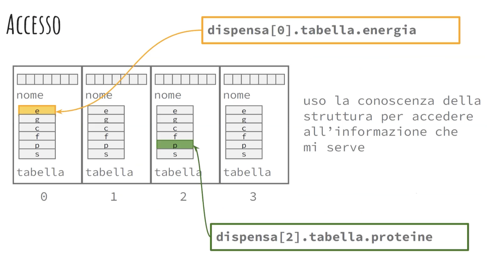

# Prog II

# Lezione 1

## File Header

```c
#include <stdio.h>
#include "PATH/nomefile.h"
```

Se modifico il codice di una funzione, ma non il suo prototipo, non dovrò modificare i file che la utilizzano, ma solo ricompilarli.

## Compilazione

- **pre-processing**: riceve in input un programma C, restituisce un programma C le cui direttive `#` sono state sostituite da altro testo.
- **compilatione**: traduce il file processato in linguaggio *assembly*.

```bash
gcc -S main.c
```

- **Assembling**: traduzione codice assembly a file oggetto (codice macchina).

```bash
gcc -c main.s -o main.o
```

- **Linking**: compone le diverse parti di codice in un'unico programma che può essere ccaricato in RAM per l'esecuzione. Otteniamo `main.out`

## Struttura file

```bash
.
├── README.md
├── bin
│   └── output.out
├── include
│   └── lib1.h
└── src
    └── source.c
    └── main.c
```

```bash
gcc src/source.c src/main.c -o bin/output.out
```

# Lezione 2

## Correttezza

Dato un array di interi, la funzione STAMPA visualizza tutti gli elementi dell'array.

```c
void stampa(int *arr) {
    ...
}
```

La funzioine deve trattare tutti i casi possibili, es: [1, 2, 3], [8, 5, 1], [2, , ], `NULL`.
## Progettazione delle funzioni: passi base

- Scrivere eventuali assunzioni sui dati ricevuti dalla funzione.
- Identificare i possibili casi da trattare e scrivere un esempio per ciascuno.
- Se la funzine contiene cicli: scrivere qquale condzione è vera ad ogni iterazione.
- Scrivere la condizione che sarà vera (sui dati e sull'eventuale output prodotto) al termine dell'esecuzione.

### Esempio: funzione che effettua una divisione

- **Assunzioni inizali**: assumo che la funzione riceva due valori, dividendo e divisore, e che il divisore sia diverso da zero.
- **Descrizione del codice che esplica la funzione**: effettua il calcolo.
- **Condizione sul risultato**: quando il divisore è diverso da ' il risultato sarà il valore prodotto dal primo parametro fratto il secondo parametro, altrimenti restituisco il dividendo e un messaggio di errore.

### Scrittura per raffinamenti successivi

- Assunzioni sotto forma di commenti.
- Si trasformano via via i commenti in codice.
- Alla fine si prova il codice sull'insieme di casi precedentemente identificati.

### Si può guidare la scrittura corretta?

Quando il codice è lineare gli unici errori sono di tipo **sintattico** (compilatore) e di tipo **logico** (Test Suite).

Quando il codice è strutturato o fa dei richiami ricorsivi:

- bisogna garantire la **terminazione** della funzione (niente loop infiniti).
- Bisogna garantire che **ogni passo** (iterazione) dell'esecuzione rispetti una **proprietà di correttezza**.

Terminazione + correttezza parziale = correttezza

## Correttezza parziale
$fz(t_1 \ p_1, ..., t_n \ p_n)$ è **parzialmente corretta** quando: $\forall <x_1, ..., x_n>$ ennupla di valori rispettivamente di tipo $t_1, ..., t_n$ se vale che:

1. **P-IN$(x_1, ..., x_n)$** è vera;
2. l'esecuzione di $fz(x_1, ..., x_n)$ **termina restituendo y**, allora **P-OUT**$(x_1, ..., x_n, y)$ è vera.

1. **P-IN$(x_1, ..., x_n)$**: è una proprietà dell'input.
2. **P-OUT$(x_1, ..., x_n, y)$**: è una proprietà lega l'output all'input.

### Esempio: per `quadrato(int x)`:

`P_IN(x)`: x è un numero intero,
`P_OUT(x, y)`: è y == x * x.

Una funzione è **terminante** se $\forall <x_1, ..., x_n>$ tali per cui **P-IN$(x_1, ..., x_n)$** è vera, l'esecuzione di $fz(x_1, ..., x_n)$ termina.

Una funzione $fz(x_1, ..., x_n)$ è **corretta** se valgono due condizioni:

1. È parzialmente corretta.
2. È terminante.

```c
/*
    P_IN: Assumo di ricevere un array di dimensione N (N > 0).
    P_OUT: Il valore restituito satà uno dei valori contenuti nell'array, il più piccolo.
*/

int MINIMO(int a[], int N){
	int temp = a[0]; // definisco una variabile di comodo, temporanea e la inizializzo.
	int i; // inizializzo un indice.

    for(i=1, i<N, i++){ // ciclo per scorrere l'array
		if(a[i] < temp) // per decidere se aggiornarla la confronto con l'elemento corrente
			temp = a[i];
    }

	return temp; // alla fine restituisco il valore contenuto nella variabile temporanea.
}
```

La terminazione va dimostrata:

- Una sequenza termina sempre, se i suoi passi terminano.
- Un ciclo termina se interazione dopo iterazione ci si avvicina alla condizione di uscita.
- Qualcosa di simile vale per le funzioni ricorsive.

Ovvero:

- `MINIMO`contiene un **ciclo for**
- La condizione di uscita è che l'indice *1* (inizializzato a 0) **diventi uguale a N**.
- Ad ogni iterazione l'indice *i* aumenta di 1.
- Quindi, prima o poi, renderà vera la condizione di uscita, portando `MINIMO`a **terminazione**.

# Lezione 3

## Allocazione dinamica

`TIPO NOME;` dichiarazione.

`NOME = ESPRESSIONE;` assegnazione.

```c
int x;

x = 0;

x = x+1;
```

### Variabile

**TIPO**: Quanti byte occupa, come sono organizzati.

**NOME**: Identifica la variabile per il programmatore.

**INDIRIZZO**: Identifica l'area di memoria occupata dalla variabile per l'esecuzione.

**VALORE**: Dato contenuto nell'area di memoria di una variabile.

|          |          |
| ----------- | ----------- |
| **&vrb**   | Indica l'indirizzo della variabile `vrb` |
| ***indexp**   | L'operatore `*` dereferenzia un'espressione, cioè permette di accedere al contenuto della cella che ha l'indirizzo calcolato dall'espressione `indexp`        |
| ***(&vrb)**   | Caso particolare, indica il contenuto della variabile che ha per indirizzo `&vrb`        |

## Allocazione e deallocazione dinamica

Effettuate durante l'esecuzione del programma, occorre utilizzare delle funzioni predefinite:

```c
#include <stdlib.h>

void *malloc(size_t size);	// memory allocation

void free(void *ptr);
```

## `malloc`

`malloc`: allocazione dinamica (durante l'esecuzione del programma) della memoria. `malloc(8)` cerca nella RAM una porzione di memoria di almeno **8 byte** e la riserva per il programma che ne ha fatto richiesta.

`prt = (int *)malloc(sizeof(int));` assegna l'indirizzo della porzione di memoria riservata a `prt`. `(int *)`: casta il puntatore generico a un puntatore di tipo `int`, `sizeof(int)` restituisce il numero di byte occupati da un intero (8).

`void *malloc(8)`: `void *` indica un puntatore generico.

## `free`

`free(ptr)`: deallocazione della memoria precedentemente allocata.

## Allocazione statica vs dinamica

**Allocazione statica**:

```c
int x;
x = 0;
```

`0x7fff09a50eec`= 0

**Allocazione dinamica**:

```c
int *x;
x=(int *)malloc(sizeof(int));
*x = 0;
```

`0x7fff09a50eec`= `0x7fff09a50ef0`

`0x7fff09a50ef0` = 0

```c
free(x);
```

`0x7fff09a50eec`= `0x7fff09a50ef0`

`0x7fff09a50ef0` = errore

---

Programma in esecuzione -> processo -> ha allocata una porzione di RAM:

- Heap: memoria allocata dinamicamente. `malloc`, `free`.
- Stack: esecuzione, record di esecuzione, variabili allocate staticamente.

**Array**:

```c
int v[10];
```

Quanto spazio occupa? `10*sizeof(int)`.

Posso usare `v+1`? Sì, `v+1` è l'indirizzo del secondo elemento.

Posso fare `v++`? No, `v` è un puntatore costante.

**Allocazione dinamica di un array**:

```c
int *d;
...
d = (int *)malloc(10*sizeof(int));
```

`d` = `0xabdf08134ba0` ovvero `0xabcf08134ba0`"[0]", il primo elemento dell'array.

Quanto spazio occupa? Spazio array + `sizeof(int *)`, cioè 8 byte.

Posso usare `d+1`? Sì, `d+1` è l'indirizzo del secondo elemento.

Posso fare `d++`? Sì, `d` è un puntatore.

```c
free(d);

d = NULL;
```

Libero la RAM, assegno `NULL` al puntatore manualmente.

---

# `struct`

Collezione di dati correlati che posso essere disomogenei.

**Libro**:

- **Titolo**: stringa
- **Numero pagine**: intero
- **Autore**: stringa
- **Prezzo**: float

```c
struct libro {
	char titolo[MAXT];
	int pagine;
	char autore[MAXN];
	float prezzo;
};
```

Non ha allocata memoria, è solo una descrizione.

```c
struct libro L1;
```

`L1` è una variabile di tipo `struct libro`.

### Esempio

```c
struct _cibo {
	char nome[MAX];
	struct dich_nutriz tabella;
} dispensa[MAXD];
```

In dispensa ci sono tanti cibi, ognuno con un nome e una tabella nutrizionale. Array di struct, ognuna comprende un'etichetta e una dichiarazione nutrizionele.

`DIESPENSA` contiene elementi omogenei ma di tipo articolato in campi strutturalmente complessi.

```c
dispensa[0].tabella.energia

dispensa[2].tabella.proteine
```



I campi hanno dimensione diversa. Sono allocati in ordine di specifica. I sistemi operativi non allocano la memoria a byte, ma a gruppi di 4, 8, 16, ... byte.

Una `struct` può avere allocata un po' più memoria dello stretto necessario(**padding**).

### Esempio di padding:

```c
struct prova {
	char x;
	char y;
	int z;
};
```

```c
sizeof(struct prova) = 8;

sizeof(char)*2 + sizeof(int) = 6;
```

# Lezione 4

## Tipi di dati composti

- **Array**: sequenza di elementi dello stesso tipo.
- **Struct**: insieme di elementi di tipo diverso.

```c
struct {
	char titolo[MAXT];
	char autore[MAXA];
	int pagine;
} L1, L2; // variabili con questa tipo di struct

struct libro { // dichiarato un nome della struct
	char titolo[MAXT];
	char autore[MAXA];
	int pagine;
};
```

```c
struct libro L1; // struct libro è un nome associato ad una descrizione di certi dati in memoria
```

## `typedef`

Viene utilizzata per dichiarare dei *tipi*.

```c
typedef int NUM_P; // nome di un nuovo tipo per numeri di pagine
NUM_P x;
```

Possiamo associare a una struttura un nuovo nome di tipo.

```c
typedef struct {
	char titolo[MAXT];
	char autore[MAXA];
	int pagine;
} LIBRO;

LIBRO L; // dichiaro una variabile L di tipo LIBRO
```

Come negli array posso accedere alle varie informazioni che `LIBRO` contiene. Nelle strutture non si accede per posizione, ma per **nome**.

```c
L.titolo = "Ciao";
L.autore
L.pagine = 100;

strcpy(x, L.titolo); // copia il contenuto di L.titolo in x
```

### Padding

```c
sizeof(LIBRO) = k;
sizeof(char) + N + sizeof(char) * M + siszeof(int) + sizeof(int) = q;
```

Ci sono casi in cui `k > q`. Perchè l'OS assegna alla memoria un processo per multipli di una certa quantità di byte.

---

Posso costruire la struttura anche in modo dinamico, tramite `malloc`.

```c
LIBRO *PL;

PL =  (LIBRO *)malloc(sizeof(LIBRO)); // cast a tipo LIBRO, PL è un indirizzo
```

```c
PL -> titolo; // indica che PL è un puntatore a una struttura, accede al campo titolo
```

---

## Esercizio

```c
#include <stdio.h>
#include <stdlib.h>
#include <string.h>

#define MAXT 10
#define MAXA 200
#define MAXL 20

//
// Definizione del tipo LIBRO
//
typedef struct {
	char titolo[MAXT];
	char autori[MAXA];
	int pagine;
} libro;

//
// Definizione del tipo bib (biblioteca)
//
typedef struct {
	libro elenco[MAXL]; // elenco dei libri
	int numero;         // num. libri al momento
} bib;

// test
int piena(bib B) {
    return (B.numero == MAXL);
}

// visalizzazione dei contenuti di una variabile di tipo bib
void stampa_bib(bib B) {
	int i, top=B.numero;
	for(i=0; i<top; i++) printf("\n[%d] %s %s %d", i, B.elenco[i].titolo, B.elenco[i].autori, B.elenco[i].pagine);
	printf("\n");
}

// vista a lezione: se B non è piena aggiunge i dati relativi a un nuovo
// libro senza cancellare dati precedenti e in maniera consecutiva ai dati
// relativi a libri inseriti fino a quel momento
void inserisci(bib *B, char *t, char *a, int p) {
	if (!piena(*B)) {
		B->elenco[B->numero].pagine = p;
		strcpy(B->elenco[B->numero].titolo, t);
		strcpy(B->elenco[B->numero].autori, a);
		B->numero++;
	}
	else printf("\nATTENZIONE: biblioteca piena\n");
}

// vista a lezione: inizializza una variabile di tipo bibi riferita da B
// (biblioteca vuota)
void init(bib *B) {
	B->numero=0;
}

int main() {
    bib biblioteca; // dichiaro una variabile di tipo biblioteca
    
    init(&biblioteca); // la inizializzo
    
    inserisci(&biblioteca,"1984","Orwell",250); // inserisco un libro
    inserisci(&biblioteca,"Odissea","Omero",200); // inserisco un altro libro
    
    stampa_bib(biblioteca); // vedo cosa contiene
}
```


## `init` statico e dinamico

```c
init(&statica);

init(&dinamica);
```

## Lezione 5

## Puntatori come cursori di array

Il nome di un array è di per sè un puntatore.

```c
main(){
	int prova[N];
	init(prova);
	...
}
```

Stack di esecuzione:

init a[indirizzo]

prova[indirizzo della prima cella dell'array] -> [][][]...[]

```c
void init(int *a) {
	for(int i=0; i<N, i++, a++){
		*a = 100+i;
	}
}
```

```c
int main(){
	int prova[N];
	int *cursore;
	int valore;

	init(prova);

	for(cursore = prova + 9, valore = 1; cursore != prova; cursore--, valore++){
		// cursore punta all'ultima cella dell'array prova
		// cursore viene decrementato, punta alla cella precedente
		*cursore = valore;
	}
}
```

[10][9][8][7][6][5][4][3][2][1] (prova[10])

---

## Strutture dati ricorsive

Gli elementi di una struttura dati ricorsiva si dicono **nodi**.

**Linked List**:

Struttura dati lineare, una sequenza.

*Definizione ricorsiva*:

- È **vuota** (-*)
- È **costituita da un elemento seguito da una linked list** ([n])

[a]->[b]->[c]-*

Ruoli:

- [a]: primo elemento, predecessore di [b]
- [b]: predecessore di [c], successore di [a]
- [c]: ultimo elemento, successore di [b]

Quando rimuovo un nodo da una lista, la lista deve essere ancora consistente.

Errore:

[a]->[x]-*

Giusto:

[a]-*

Togliere il primo nodo significa spostare il cursore al secondo nodo.

**Lista vuota** = `NULL`

La variabile deve essere un puntatore ad un nodo.

`tipo-nodo *spesa;`

Per aggiungere un elemento devo:

- Creare un nodo (uova)
- Aggiungi nodo a spesa:
  - successore di nodo = spesa
  - spesa = indirizzo di nodo

```c
spesa = NULL; // [uova]-*

// spesa[* [uova]-*]
```

Creare nodo invoca una `malloc`, quindi la memoria è allocata dinamicamente.

I nodi allocati si trovano nell'**heap**.

Ogni nodo è una struttura dati composta da almeno 2 parti:

- **Dati**
- **Link al successore** (`NULL` in assenza su di successori)

```c
struct nodo {
	int num;// campi dati

	struct nodo *next; // link al successore
};

struct nodo spesa;
```

Dobbiamo trovare una convenzione per sapere che la lista è vuota. Sprecando spazio nella memoria per dire ciò. Basterebbe un puntatore a `NULL`.

```c
struct nodo {
	int num;// campi dati

	struct nodo *next; // link al successore
};

struct nodo *spesa;
```

La variabile che permette l'accesso alla lista deve essere un **puntatore** (`*spesa`). Cos' facendo `spesa` non ha lo spazio per contenere un nodo, ma solo quello per contenere un indirizzo.

Il primo nodo è creato con la `malloc` solo quando serve.

```c
x = (struct nodo *)malloc(sizeof(struct nodo));
```

In modo più fine usiamo il `typedef`.

```c
typedef struct nodo *lista;

struct nodo {
	// campi dati

	lista next; // successore
};

lista spesa = NULL;

x = (lista)malloc(sizeof(struct nodo));
```

In memoria bbiamo sempre `spesa` (in stack) che punta al primo nodo (in heap).

### Accedere ai vari elementi della lista


# Lezione 5

